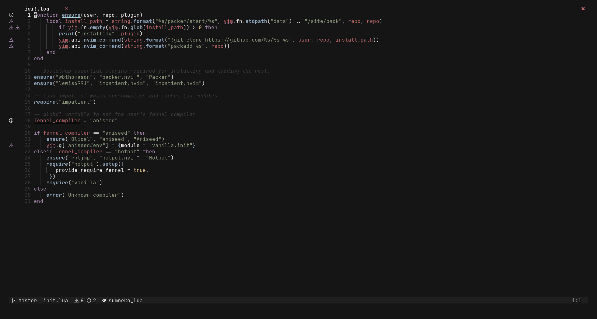
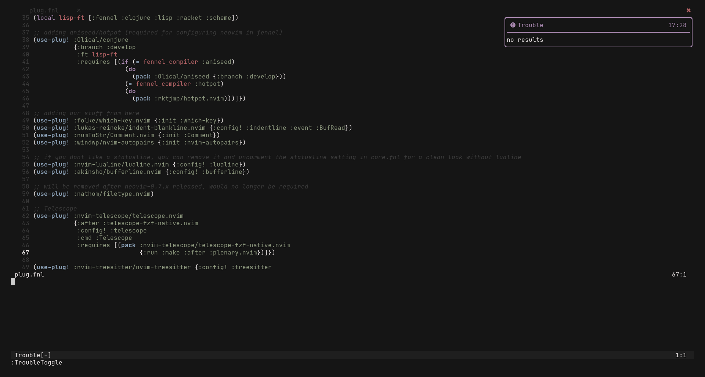
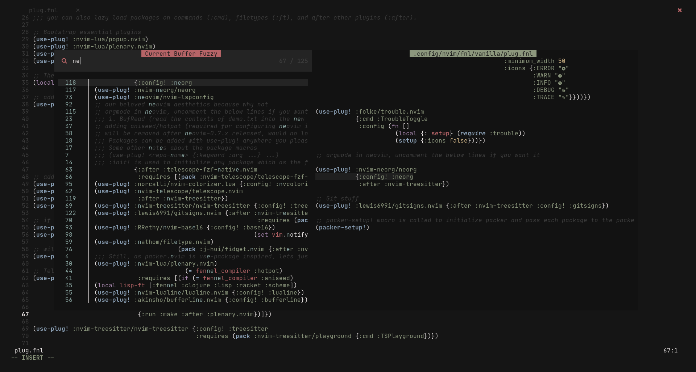
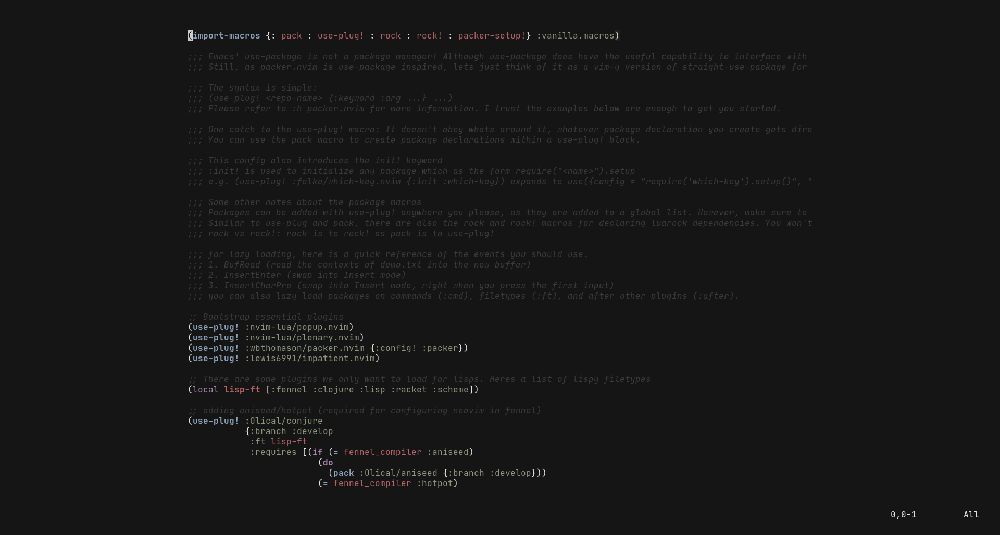
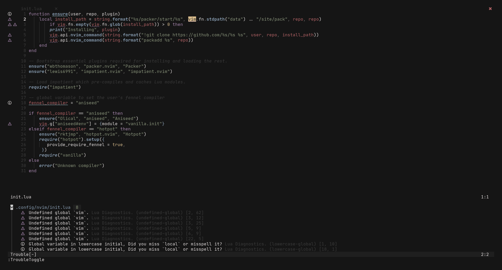
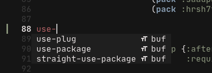
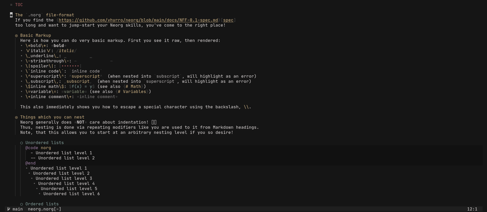
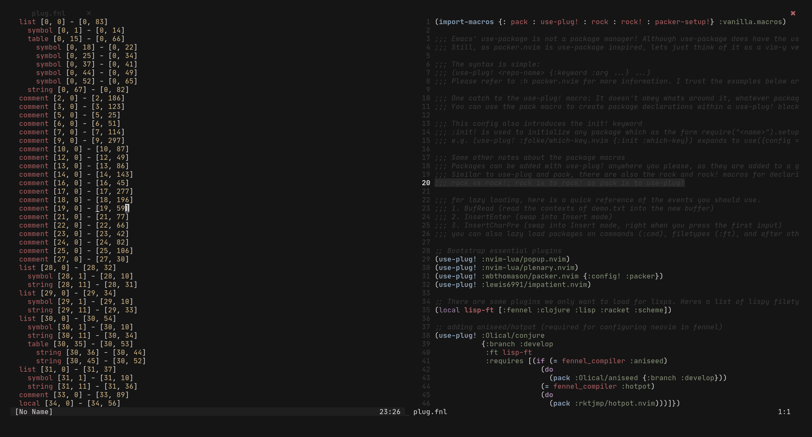
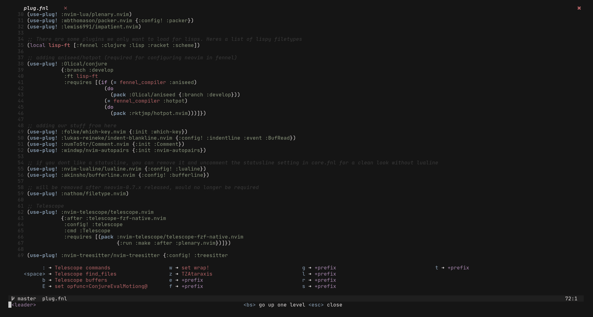

# Daydream.nvim

<div align="center">

[](https://fennel-lang.org)

</div>

<div align="center">

[](https://github.com/Mayooonaiselol/Daydream.nvim/stargazers)
[](https://github.com/Mayooonaiselol/Daydream.nvim/issues)
[](https://github.com/Mayooonaiselol/Daydream.nvim/network/members)
[](https://mit-license.org/)

</div>

[Skip to Installation](https://github.com/Mayooonaiselol/Daydream.nvim/tree/master#install)

[Skip to Showcase](https://github.com/Mayooonaiselol/Daydream.nvim/tree/master#showcase)

Neovim configuration useful for Emacs users who want to use neovim(but can also be used by others), who may find configuring neovim in fennel easier, works on neovim 0.6.1 and later.

This is a neovim config written in fennel, many parts of this config are based on [nyoom.nvim](https://github.com/shaunsingh/nyoom.nvim)

This awesome colourscheme used in these configs is [paradise](https://github.com/Manas140/paradise)

Everything happens in the `fnl/` folder.

- `init.fnl` to require fennel configs (not plugin configs, you have to define that in plug.fnl)
- `colors.fnl` to define your colourscheme (current one used in the configs is paradise)
- `core.fnl` to set neovim settings and autocmds
- `keys.fnl` to set keybinds/mappings
- `plug.fnl` to add and install plugins using packer.nvim
- `macros.fnl` to define functions and make configuring easier, I have added macros which can even work with neovim 0.6.1 and some other macros on top of the base config from nyoom.nvim (you are free to edit this if you know what it is)
- `plugins/` to define plugin configs

If you need any help, you can ask me at discord or join the [Conjure Discord](https://conjure.fun/discord)

## Useful plugins used

- [which-key.nvim](https://github.com/folke/which-key.nvim)
- [indent-blankline.nvim](https://github.com/lukas-reineke/indent-blankline.nvim)
- [lualine](https://github.com/nvim-lualine/lualine.nvim)
- [bufferline](https://github.com/akinsho/bufferline.nvim)
- [Telescope](https://github.com/nvim-telescope/telescope.nvim)
- [Comment.nvim](https://github.com/numToStr/Comment.nvim)
- [nvim-autopairs](https://github.com/windwp/nvim-autopairs)
- [treesitter](https://github.com/nvim-treesitter/nvim-treesitter)
- [lspinstaller](https://github.com/williamboman/nvim-lsp-installer)
- [nvim-cmp](https://github.com/hrsh7th/nvim-cmp)
- [Luasnip](https://github.com/L3MON4D3/LuaSnip)
- [truezen](https://github.com/Pocco81/TrueZen.nvim)
- [nvim-colorizer.lua](https://github.com/norcalli/nvim-colorizer.lua)
- [Neorg](https://github.com/nvim-neorg/neorg)
- [Gitsigns](https://github.com/lewis6991/gitsigns.nvim)
- [Trouble.nvim](https://github.com/folke/trouble.nvim)
- [TSPlayground](https://github.com/nvim-treesitter/playground)

## Credits

- [shaunsingh](https://github.com/shaunsingh) for making nyoom.nvim and helping me out with fennel
- [Manas](https://github.com/Manas140) for the eye-pleasing colourscheme and contributions for these configs
- [keymaster](https://github.com/pagankeymaster) for making a neovim config dictionary...

## Showcase



Notifications



Telescope



Focus mode (Truezen)



Trouble.nvim and neovim LSP



Completions



Neorg(not a default, just uncomment lines in plug.fnl to use it)



TSPlayground showing treesitter info



which-key.nvim



## Install

### Dependencies

The only dependencies are neovim-0.6.1+, a font with nerdfont icons and git.

### Regular:

Install the following dependencies: 
- neovim-0.6.1+
- ripgrep
- nodejs (optional)
- fennel + fnlfmt (not required, but recommended)
- font with nerdfont icons
- build-tools (optional, if errors occur)

Backup your configs first!

```bash
mv ~/.config/nvim ~/.config/NVIM.BAK
```

Clean all the required directories

```bash
rm -rf ~/.config/nvim
rm -rf ~/.local/share/nvim
rm -rf ~/.cache/nvim
```

Install using the following command:

```bash
git clone https://github.com/Mayooonaiselol/Daydream.git ~/.config/nvim --depth 1 && nvim +PackerSync
```
