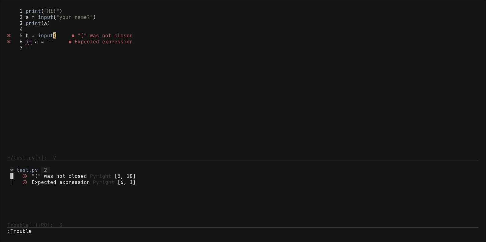
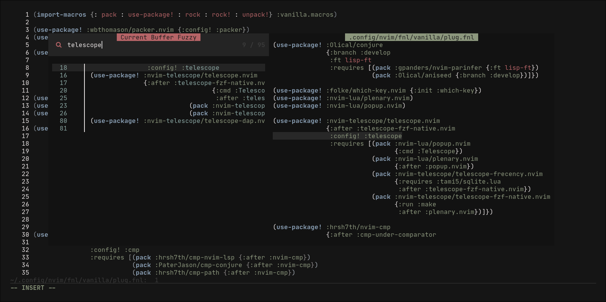
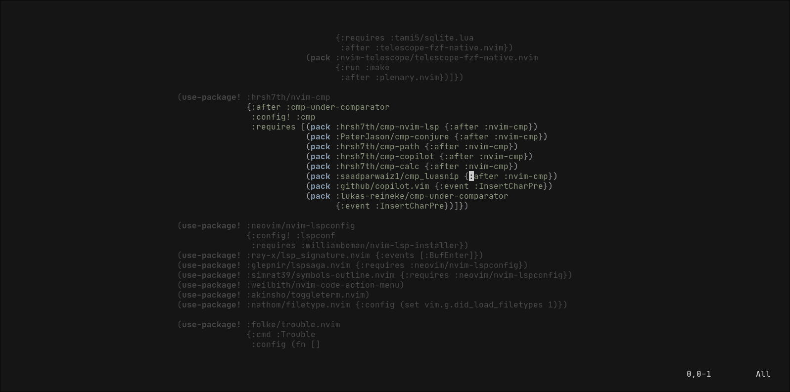
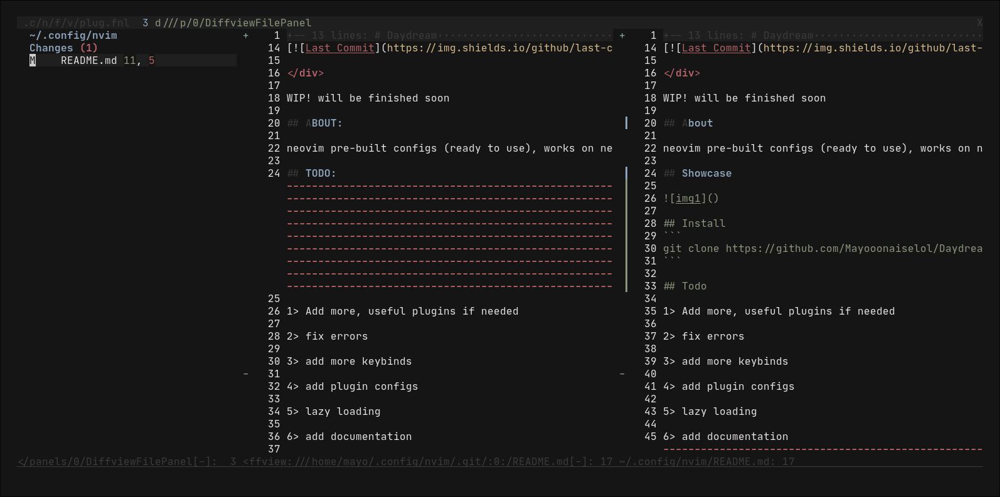
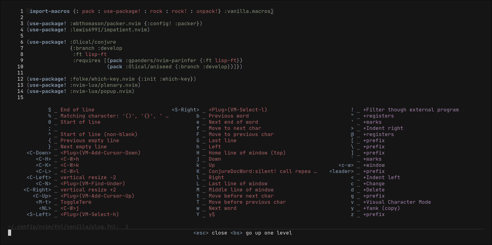
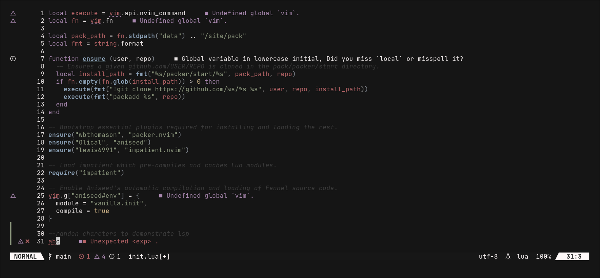

# Daydream.nvim

<div align="center">

[](https://fennel-lang.org)

</div>

<div align="center">

[](https://mit-license.org/)
[](https://github.com/neovim/neovim)
[](https://github.com/Mayooonaiselol/Daydream.nvim/issues)
[](https://github.com/Mayooonaiselol/Daydream.nvim/pulse)

</div>

WIP! will be finished soon

## About

neovim pre-built configs (ready to use), works on neovim 0.6.0 and later versions

## Showcase

Code completions






Focused editing



Git plugins





New! Lualine showing LSP stats



## Install

### Dependencies

The only dependencies are neovim-0.6.1+ and git.

### Regular:

Install the following dependencies: 
- neovim-0.6.1+
- ripgrep
- nodejs (optional, for copilot)
- fennel + fnlfmt (not required, but recommended)
- font with nerdfont icons
- sqlite
- build-tools (optional, if errors occur)

Linux:
```bash
git clone https://github.com/Mayooonaiselol/Daydream.git ~/.config/nvim --depth 1 && nvim +PackerSync
```

Windows:
```
git clone https://github.com/Mayooonaiselol/Daydream.git Appdata\Local\nvim\ --depth 1; nvim +PackerSync
```

## Todo

- Add more, useful plugins if needed...Too many added, cleanup needed
- fix errors...Done
- add more keybinds
- add plugin configs...Mostly Done
- lazy loading
- add documentation
